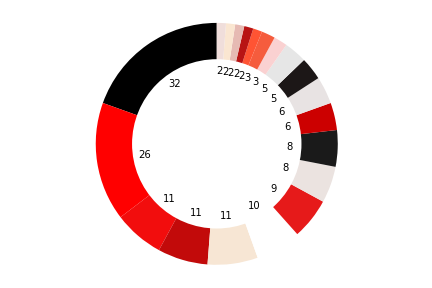
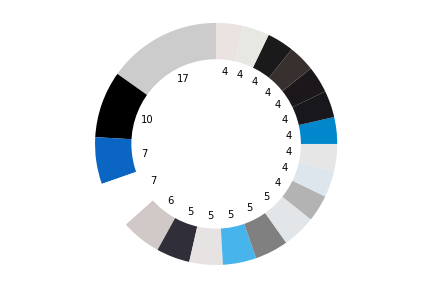

Motivations
-------

In my current job but also in past jobs, I often came across the recurring need of our clients to have qualitative insights on their social media presence.
I am used to provide quantitative insights based on classic KPIs such as reach, impressions, engagement, etc. But what is trickier is to build a story to the client
with qualitative insights without doing it manually (it takes a lot of time!). For example, some clients want to understand the communication strategy of their
competitors in order to stand out from them. Do they have a specific tone of voice? Do they use the same set of colors to communicate?

This is how I got the idea to work on this project! The objective is to create a **color clustering tool which will extract the most used colors of an Instagram page**.

Sources
-------

This article helped me to build the K-Means clustering algorithm to extract the top colors of an image:
*https://towardsdatascience.com/color-identification-in-images-machine-learning-application-b26e770c4c71*

I found this article which was quite similar with what I had in mind for this project. This helped me to build the methodology to merge the data of all the pictures
of an Instagram page.
*https://mode.com/blog/brand-colors-on-instagram/*

I used this library to extract Instagram pictures:
*https://instaloader.github.io/*

The code
-------

Click [here](https://github.com/SalimAmarti/Color_Classifier/blob/master/Color%20classifier.ipynb) to view the code.

Executive Summary
-------

In the code, donut charts are created to show an overview of the twenty most used colors of an Instagram page. The donut charts also show how frequent a specific color was the most used color of a picture.

Have a look at two examples below:

 

*[Coca Cola](https://www.instagram.com/cocacola/) vs. [Pepsi](https://www.instagram.com/pepsi/)*

Approach
-------

- First, I used the Instaloader library to extract Instagram pictures only (I did not consider videos). The code asks the user if he wants to extract all the data of the Instagram page or restrict it to a specific time period. This is particulary useful knowing that Instagram has rate limits for picture scraping.

- Then, I performed the K-Means clustering machine learning algorithm on each picture to extract the top 3 most used colors. I stored the RGB value of the most used color in an Excel file.

- However, the RGB color model is not ideal because it cannot be easily understood by a human-user. The final goal is to create clusters of colors and define the most used colors of an Instagram page. If we use the RGB color model, it would be too hard to group similar colors together. This is why I used the HSL (Hue, Saturation, Lightness) color model which is way more understandable. Hue is a degree on the color wheel, from 0° to 360°. Saturation is a percentage value, 0% means a shade of grey and 100% means the full color. Lightness is also a percentage value, 0% is black and 100% is white. Look at the graph below from Wikipedia which sums up the HSL color model:

  

- This means that the HSL color model covers 3'600'000 colors. This is way too large to cluster colors together. With such a variety of colors, each top color would be considered unique. I decided to reduce this variety. First, I only considered 36 colors in the color wheel, instead of 360. And I only considered 10 possibilities both for the Saturation and Lightness. This reduced the variety of colors to 3'600. I ran the code multiple times and I still felt like it was too much. I decided to divide the Hue and only consider 18 Hue possibilities. The current color model I created consider 1'800 unique colors.

- Now the code is able to group similar top colors together and draw a donut chart with the number of occurrences for each top color.

Next steps / Improvements
-------

- Working on extracting the top colors of a video. This would be a project on its own, but now Instagram users often share videos on their pages. Excluding them means removing a high share of the content.

Infographics
-------

*Work in progress...*
